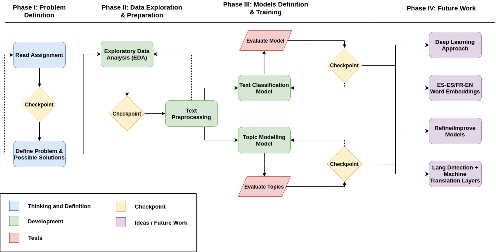

# Electronic Arts (EA) Assignment for: NLP Associate Data Scientist


__The goal of the test is working with a multi-language dataset, in order to demonstrate your Natural Language 
Processing and Machine Translation abilities.__

The Core Data Scientist and Storytelling attributes will also be evaluated during your resolution of the case.

`About the Data`:

The dataset you will be using is a multilingual, multi-context set of documents, which are a part of the one 
described on the following paper: _Ferrero, Jérémy & Agnès, Frédéric & Besacier, Laurent & Schwab, Didier. 
(2016). A Multilingual, Multi-Style and Multi-Granularity Dataset for Cross-Language Textual Similarity Detection._

Please note the dataset is divided on contexts/categories (Conference_papers, Wikipedia, ... ) and on languages, 
in the same way the folders are structured.

* `Objective 1`: Create a document categorization classifier for the different contexts of the documents. You 
will be addressing this objective at context level, regardless of the language the documents are written in.

    Tasks/Requirements:

    * EDA: Exploratory data analysis of the Dataset.
    * Reproducibility/Methodology: The analysis you provide must be reproductible. Your analysis will fulfill 
    the Data Science methodology.
    * Classification model: The deliverable will include a model which will receive a document as input and will 
    output its class, which will be the context of that document.

* `Objective 2`: Perform a topic model analysis on the provided documents. You will discover the hidden topics 
and describe them.

    Tasks:

    * Profile the different documents and topics.
    * Provide a visualization of the profiles.

---

## Table of Contents

* [Roadmap](#roadmap)
* [Repository Content](#repository-content)
* [Exploratory Data Analysis](#exploratory-data-analysis)
* [Text Preprocessing](#text-preprocessing)
* [Text Classification](#text-classification)
* [Topic Modelling](#topic-modelling)
* [Conclusions](#conclusions)
* [Future Work](#future-word)
* [References](#references)
* [Personal Opinion](#personal-opinion)
* [EA's Expected Way to Tackle](#eas-expected-way-to-tackle)


---

## Roadmap

Before proceeding with the explanation and conclusions of every NLP tasks researched/developed for the project,
we will start by specifying the roadmap since the start day which was on Friday, July 31 until the end date of 
the project which was on Tuesday, August 4.



---

## Repository Content

    .
    ├── documents_challenge/          # Dataset of Multilingual Multi-Context documents
    ├── research/                     # Jupyter Notebooks and Reports of the project's research
    ├── slides/                       # Jupyter Slides for presenting the project
    |── imgs/                         # Contains some image resources
    ├── 202007TestADS.pdf             # Electronic Arts (EA) Associate Data Scientist Assignment PDF File
    ├── LICENSE                       # MIT License so as to release the code open-source
    ├── README.md                     # Detailed README.md so as to explain the project
    └── requirements.txt              # Requirements to reproduce the Jupyter Notebooks

A description of the dataset and its building are described in the following paper:

[_A Multilingual, Multi-Style and Multi-Granularity Dataset for Cross-Language Textual Similarity Detection. Jérémy Ferrero, Frédéric Agnès, Laurent Besacier and Didier Schwab. In the 10th edition of the Language Resources and Evaluation Conference (LREC 2016)_](https://www.researchgate.net/publication/301861882_A_Multilingual_Multi-Style_and_Multi-Granularity_Dataset_for_Cross-Language_Textual_Similarity_Detection)

---

## Exploratory Data Analysis

Before starting any NLP project, we first need to explore and understand the data we have 
so as to decide how are we going to tackle the problem we are facing.

We can see the dataset statistics from the GitHub repository [FerreroJeremy/Cross-Language-Dataset](https://github.com/FerreroJeremy/Cross-Language-Dataset):

Sub-corpus | Alignment | Authors | Translations | Translators | Alteration | NE (%)
--- | --- | --- | --- | --- | --- | --- |
__Wikipedia__ | Comparable | Anyone | - | - | Noise | 8.37
__PAN-PC-11__ |  Parallel |  Professional authors | Human | Professional | Yes | 3.24
__APR (Amazon Product Reviews)__ | Parallel | Anyone | Machine | Google Translate | No | 6.04
__Conference papers__ | Comparable | Computer scientists | Human | Computer scientists | Noise | 9.36

During the EDA is common to plot diverse features so as to get some sort of insights on how the data is
structured accross the documents, in order to find the proper way to tackle the problem and the upcoming NLP
steps. Then, some visualizations are provided below, with some interesting data that will be explained later:


In this case, we plotted the distribution of the documents per context and language and the median lenght of
each single document per context, where it showed that Wikipedia is the most populated context and French texts 
the biggest amount. Also both the APR and the Conference papers are the ones with fewer characters, and the PAN11
texts are between the Wikipedia and the other texts.

__Reference__: [Data Exploration](https://github.com/alvarobartt/ea-associate-ds/blob/master/research/01%20-%20Data%20Exploration.pdf)

---

## Text Preprocessing

__When it comes to NLP, data preprocessing is one, it not the most, important tasks__, since we
are adding value to the raw data.

For this project, since we are facing a Mulit-Lingual Multi-Context dataset, we need to develop
a custom preprocessor which preprocesses the texts no matter the language (English, French and Spanish)
which also includes some more specific preprocessing related to the different contexts.

The defined steps towards a proper preprocessing are defined as it follows:

1. __Clean Tabs and Line Breaks__: line breaks and tabs are common in text, so we will just replace them 
by an space so as to make sure that removing them does not imply different words coming together.
2. __Convert to Unidecode__: so as to unify all the data, convert very str to unidecode which will replace
the accented vowels by its regular unaccented form, etc.
3. __Substitute Regular Expressions__: from a given collection of regular expressions, every match between 
the regular expression and any group in the text will be replaced by a space and, so on, removed.
4. __Lower Case__: unify all the str to lower case, so as to identify the same words with different capitalizations 
as the same words since all the characters will match. 
5. __Split by Apostrophes__: since both English and French use the apostrophe to abbreviate text, words will be 
splitted by its apostrophe if found so as to obtain two separate words from the apostrophe joined word.
6. __Remove Small Words__: a threshold has been set so as to remove the words with less than 3 characters, 
since those words do not provide any useful information towards the models we need to train.
7. __Remove Stopwords__: stopwords from a list of default stopwords from every language should be removed, 
and also some additional stopwords manually identified per language and context have been included so as 
to provide a complete specific stopwords removal.
8. __Remove Extra Spaces__: as every regular expression and unknown character has been replaced by a space, 
now multiple spaces will be substituted by a single space so as to return a str which is indeed a 
space-separated list of tokens.

So on, we have created a `CustomPreProcessor` which is indeed Python interface so as to preprocess 
all the raw data.

```python
class CustomPreProcessor(object):
    """
    Custom PreProcessor

    Preprocesses the introduced raw text to transform it into clean text. This
    preprocessing pipe is regex based.

        >>> from apinlp.nlp.preprocessing import CustomPreProcessor
        >>> preprocessor = CustomPreProcessor()
        >>> print(preprocessor._preprocess("Visit us at https://www.ea.com/"))
        "visit"
    """
    
    def __init__(self, strip_accents=True):
        self.strip_accents = strip_accents
        
        self.patterns = BASE_PATTERNS
        self.additional_patterns = (SPACES_PATTERN,)

        self.stopwords = STOPWORDS

    def _preprocess(self, text):
        """Cleans and applies a preprocessing layer to raw text"""
        text = text.replace('\t', ' ').replace('\n', ' ')
        
        if self.strip_accents:
            text = unidecode(text)

        for pattern in self.patterns:
            text = pattern.sub(' ', text)

        text = text.strip().lower()
        text = text.replace("'", " ")
        
        text = [word for word in text.split(' ') if len(word) > 2]

        for word in self.stopwords:
            text = list(filter((word.lower()).__ne__, text))

        text = ' '.join(text)
            
        for pattern in self.additional_patterns:
            text = pattern.sub(' ', text)
    
        return text
```

Finally, we can see an example on how did the WordClouds improve with the preprocessed 
data compared to the raw one.


__Reference__: [Data Preprocessing](https://github.com/alvarobartt/ea-associate-ds/blob/master/research/02%20-%20Data%20Preprocessing.pdf)

---

## Text Classification

Since we are facing a NLP Text Classification problem which consits on classifying multilingual data into its context
regardless the language in which the text is written.

First of all, we need to define a vectorizer so as to transform the input text (already preprocessed) into a vector 
and then train a model which is being fitted with those vectors. In this case we will be using the TF-IDF Vectorizer 
since it is the most suitable towards tackling this problem, since it ponderates the number of occurrences of each 
word inside a document with the number of occurrences of that word among all the other documents, so as to identify 
the relevance of a word appearing in a document towards later predict the context in which that concrete piece 
of text should be classified. 

Once the vectorization is completed we should just decide which classification model are we going to use depending 
on both the scope and the model's requirements/limitations. In this case, since we decided to test some different 
classification models, we just tested them over random stratified folds so as to see which of them performed better.


So on, after training some different classification model over some random stratified data shuffling folds, we
decided to proceed using the `LinearSVC` model since it seemed to be the most consistent one in both time and
accuracy. Then, the resulting Pipeline looks as it follows:

```python
from sklearn.pipeline import Pipeline

pipeline = Pipeline([
    ('vect', TfidfVectorizer(min_df=5)),
    ('clf', LinearSVC())
])
```

__References__:

* [Text Classification Model](https://github.com/alvarobartt/ea-associate-ds/blob/master/research/03%20-%20Text%20Classification%20Model.pdf)
* [Text Classification Model Testing](https://github.com/alvarobartt/ea-associate-ds/blob/master/research/04%20-%20Text%20Classification%20Model%20Testing.pdf)

---

## Topic Modelling

In this concrete case, we will be using the preprocessed data so as to fit a Topic Modelling algorithm in order
to discover the inner insights of the data and detect the hidden topics in order to have a deeper understanding 
on what is data about and into which topics is the data separated.

NLP Topic Modelling is a relevant part of the analysis, since it allows us to gain more insights about the
dataset we have, but since it is unsupervised, it requires us to tune the parameters until we can point out useful
conclusions which make sense from the given dataset.

So on, we used the LDA (Latent Dirichlet Allocation) algorithm to identify the hidden topics in the dataset, so as 
use case we started the Topic Modelling just with English texts from Wikipedia, so as to test if it worked as expected
and also to evaluate the results of one of the most populated contexts.


As we can see above, after a lot of tuning five topics were clearly identified, so we tried to establish a 
relationship between the hidden topics and real topics such as Sports for example, from the top terms that were
present in those topics. And, the identified topics in the image above are (in ascending order by topic ID): 
Politics/History, Music/Movies/Entertainment, Industry/Research/Chemistry, Sports/Games and Technology/Software.

Topic Modelling has been applied and analysed for every possible combination of context and language, and it has 
been deeply analysed in the Jupyter Notebooks.

__References__:

* [Topic Modelling](https://github.com/alvarobartt/ea-associate-ds/blob/master/research/05%20-%20Topic%20Modelling.html)
* [Topic Modelling Analysis](https://github.com/alvarobartt/ea-associate-ds/blob/master/research/06%20-%20Topic%20Modelling%20Analysis.html)

---

## Conclusions

Both objectives have been successfully completed and their respective reports have been generated, tackling the 
problem as a Data Scientist should, including a detailed Story Telling on each research part developed. 
Additionally to the defined objectives, a detailed data exploration analysis and text preprocessing have 
been research/developed too, since it is probably the most relevant part of a NLP Data Scientist while 
tackling a NLP problem, as it is adding value to the raw data.

* `Objective 1`: the created model has been fit with 80% of the documents from every context and language 
and tested with the remaining 20% of the data with balanced contexts and languages too, achieving an 
accuracy of up to 98% on the validation set. Also this model has been dumped into a JOBLIB file so that 
it can be tested over unseen data.

* `Objective 2`: the topic modelling problem has been broken down into a topic modelling per context and 
language, so as to get more insights and analyse the hidden topics that can be found in each collection 
of documents, with also pretty satisfactory results evaluated in a supervised way.

To sum up, mention that even though the project tasks have been achieved and some extra points have been 
made, there is still much work ahead, so later on this Notebook, the Future Work will be defined.

__Reference__: [Conclusions & Future Work](https://github.com/alvarobartt/ea-associate-ds/blob/master/research/07%20-%20Conclusions%20%26%20Future%20Work.pdf)

---

## Future Work

As Future Work, the main line of research should be focused on developing a consistent Machine Translation 
model in order to translate text from French and Spanish into English, which will indeed improve the 
results even though they are pretty accurate now.

Since in the first EA Interview with Francisco Martínez (EA Talent Coordinator) he spoke about the EA's 
project related to Machine Translation, it would make sense to proceed with the project designing a 
consistent Machine Translation model so as to test it's efficiency towards this problem.

Another Future Work line of research should be the design of Deep Learning models maybe in TensorFlow 
or PyTorch (usually more suitable for NLP), since we are presenting a simple use case along this project, 
but reality is a bit more complex, so tackling the problem using Deep Learning models should improve the 
model's performance when the input data is bigger, more contexts are provided and more languages too.

Finally, multilingual word embeddings should be used so as to improve the models performance whatever 
the input data is, so we should be using the word embeddings so as to "translate" (get the closest word 
embedding) every word in Spanish or French to English, so as to tackle the problem as a Multi-Lingual 
input one but for the model it would just be a single language. Also, when deploying the model into a 
production environment a reliable layer of language detection should be applied so as to either apply 
the word embeddings if the text is written in French or Spanish or discard the text if it is neither 
English, Spanish nor French.

__Reference__: [Conclusions & Future Work](https://github.com/alvarobartt/ea-associate-ds/blob/master/research/07%20-%20Conclusions%20%26%20Future%20Work.pdf)

---

## References

1. [_A Multilingual, Multi-Style and Multi-Granularity Dataset for Cross-Language Textual Similarity Detection. Jérémy Ferrero, Frédéric Agnès, Laurent Besacier and Didier Schwab. In the 10th edition of the Language Resources and Evaluation Conference (LREC 2016)_](https://www.researchgate.net/publication/301861882_A_Multilingual_Multi-Style_and_Multi-Granularity_Dataset_for_Cross-Language_Textual_Similarity_Detection)

2. [_Word Translation Without Parallel Data. Alexis Conneau, Guillaume Lample, Marc'Aurelio Ranzato, Ludovic Denoyer and Hervé Jégou. In the ICLR 2018 Computation and Language (cs.CL)_](https://arxiv.org/pdf/1710.04087.pdf)

3. [Exploiting similarities among languages for machine translation. Tomas Mikolov, Quoc V. Le and Ilya Sutskever. In the Computation and Language (cs.CL)](https://arxiv.org/abs/1309.4168)

4. [_Language-specific models in multilingual topic tracking. Leah S. Larkey, Fangfang Feng, Margaret Connell and Victor Lavrenko, In the SIGIR '04: Proceedings of the 27th annual international ACM SIGIR conference on Research and development in information retrieval_](https://dl.acm.org/doi/abs/10.1145/1008992.1009061)

---

## Personal Opinion

This assignment was both rewarding and demanding, since the time was very limited and the multi-lingual problem was not my expertise so I had to do some extra research, which indeed was profitable as I gained new knowledge over that topic. Anyway, both the HR and the Technical Team have been so nice during all the process and the feedback on the assignment was far from good, as there is a lot of work in here.

__So feel free to use this repository as a sample NLP assignment template, since this is the format that the companies expect from a Data Scientist, Machine Learning Engineer, etc.__

P.S.: I had to quit the hiring process since I received a job opportunity that fitted better with me, so I quit before proceeding with the last interview.

---

## EA's Expected Way to Tackle

The approach I developed was nice and fully covered the scope of the assignment, since the Story Telling part was really relevant for EA and it is one of the most strong points in my assignment. Anyway, the EA's Location Team based in Madrid (Spain) and Cologne (Germany) was expecting the usage of [Helsinki NLP](https://huggingface.co/Helsinki-NLP) so as to translate all the texts into Spanish so as to tackle the Multi-Lingual Multi-Context problem just as a Multi-Context problem.

They proposed the usage of [huggingface/transformers](https://github.com/huggingface/transformers) in order to translate the texts as it can be shown in this example: https://huggingface.co/transformers/model_doc/marian.html#multilingual-models, which uses [MarianMT](https://huggingface.co/transformers/model_doc/marian.html) to load the Helsinki Machine Translation Models. 
